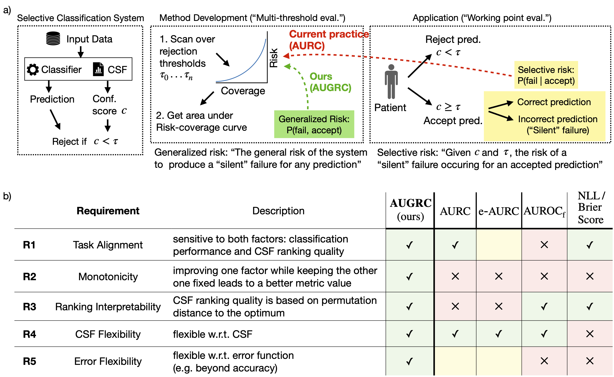

# Area Under the Generalized Risk Coverage Curve

## _Overcoming Common Flaws in the Evaluation of Selective Classification Systems_

### Abstract
> Selective Classification, wherein models can reject low-confidence predictions, promises reliable translation of machine-learning based classification systems to real-world scenarios such as clinical diagnostics. While current evaluation of these systems typically assumes fixed working points based on pre-defined rejection thresholds, methodological progress requires benchmarking the general performance of systems akin to the AUROC in standard classification. In this work, we define 5 requirements for multi-threshold metrics in selective classification regarding task alignment, interpretability, and flexibility, and show how current approaches fail to meet them. We propose the Area under the Generalized Risk Coverage curve (AUGRC), which meets all requirements and can be directly interpreted as the average risk of undetected failures. We empirically demonstrate the relevance of AUGRC on a comprehensive benchmark spanning 6 data sets and 13 confidence scoring functions. We find that the proposed metric substantially changes metric rankings on 5 out of the 6 data sets.

<p align="center">
    <figure class="image">
        
        <figcaption style="font-size: small;">
        The AUGRC metric based on Generalized Risk overcomes common flaws in current evaluation of Selective classification (SC). a) Refined task definition for SC. Analogously to standard classification, we distinguish between holistic evaluation for method development and benchmarking using multi-threshold metrics versus evaluation of specific application scenarios at pre-determined working points. The current most prevalent multi-threshold metric in SC, AURC, is based on Selective Risk, a concept for working point evaluation that is not suitable for aggregation over rejection thresholds (red arrow). To fill this gap, we formulate the new concept of Generalized Risk and a corresponding metric, AUGRC (green arrow). b) We formalize our perspective on SC evaluation by identifying five key requirements for multi-threshold metrics and analyze how previous metrics fail to fulfill them. Abbreviations, CSF: Confidence Scoring Function.
        </figcaption>
    </figure>
</p>


## Table Of Contents

<!--toc:start-->

- [AUGRC implementation](#augrc-implementation)
- [Installation](#installation)
- [Reproducing our results](#reproducing-our-results)
  - [Analysis](#analysis)
  - [Reporting results](#reporting-results)

<!--toc:end-->

## AUGRC implementation
In [rc_stats.py](fd_shifts/analysis/rc_stats.py), we provide the standalone `RiskCoverageStats` class for evaluating metrics related to Risk-Coverage curves, including an implementation of the AUGRC.

To evaluate the AUGRC for your SC model predictions:
```python
from fd_shifts.analysis.rc_stats import RiskCoverageStats
augrc = RiskCoverageStats(confids=my_confids, residuals=my_loss_values).augrc
```

## Installation
We built our study on the [FD-Shifts](https://github.com/IML-DKFZ/fd-shifts/tree/main) benchmark.
**FD-Shifts requires Python version 3.10 or later.** It is recommended to
install FD-Shifts in its own environment (venv, conda environment, ...).

1. **Install an appropriate version of [PyTorch](https://pytorch.org/).** Check
   that CUDA is available and that the CUDA toolkit version is compatible with
   your hardware. The currently necessary version of
   [pytorch is v.1.11.0](https://pytorch.org/get-started/previous-versions/#v1110).
   Testing and Development was done with the pytorch version using CUDA 11.3.

2. **Install FD-Shifts.** This will pull in all required dependencies (see [pyproject.toml](pyproject.toml) for an overview) including some
   version of PyTorch, it is strongly recommended that you install a compatible
   version of PyTorch beforehand.
   ```bash
   pip install git+https://github.com/KOFRJO/SC-eval.git
   ```

## Reproducing our results
The dataset and experiment setup is the same as described in [FD-Shifts](https://github.com/IML-DKFZ/fd-shifts/tree/main).
To use `fd_shifts` you need to set the following environment variables

```bash
export DATASET_ROOT_DIR=/absolute/path/to/datasets
export FD_SHIFTS_STORE_PATH=/absolute/path/to/your/experiments
export EXPERIMENT_ROOT_DIR=$FD_SHIFTS_STORE_PATH
```
You can choose a different `EXPERIMENT_ROOT_DIR` to save experiment evaluations to a separate directory.
[fd_shifts/main.py](fd_shifts/main.py) provides entry points for training, testing, and evaluation. To get an overview of all available subcommands, run:
```bash
python fd_shifts/main.py --help
```

E.g., to get a list of all available experiments, run:
```bash
python fd_shifts/main.py list-experiments
```

Training and inference are done via `python fd_shifts/main.py train` and `python fd_shifts/main.py test`, respectively.

### Analysis
To perform a single inference run for one of the experiments, use
```bash
python fd_shifts/main.py analysis --name=<experiment-name>
```

To perform inference on 500 boostrap samples from the test data, run
```bash
python fd_shifts/main.py analysis_bootstrap --name=<experiment-name> --n_bs=500
```

### Reporting results
To report the metric results of the experiment analysis and bootstrap analysis, use
```bash
python fd_shifts/main.py report
```
and
```bash
python fd_shifts/main.py report_bootstrap
```
